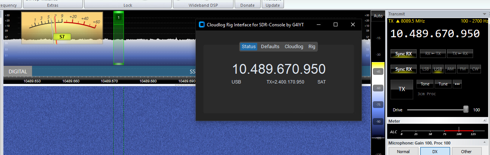
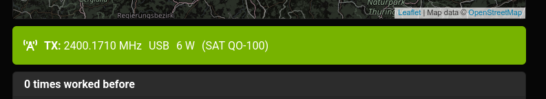
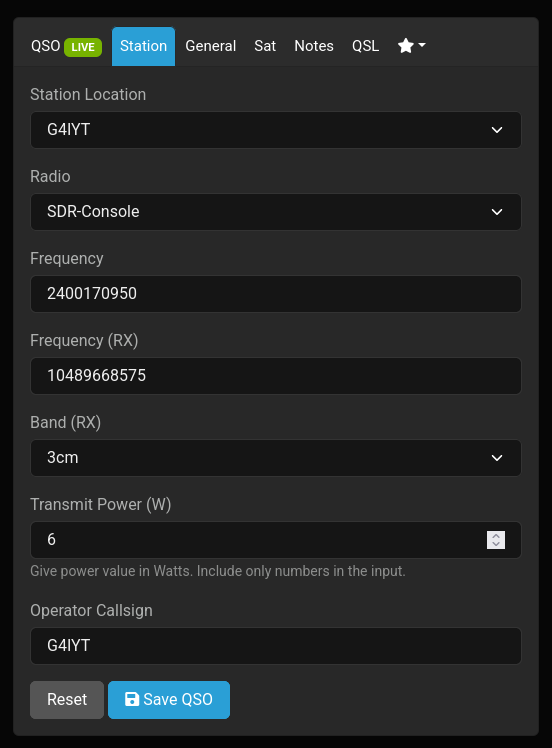

I use this tool to synchronise SDR-Console with Cloudlog while working through QO-100, so that the mode, frequency, and band fields are correctly populated in the Cloudlog QSO screen.

This makes it much easier for me to make contacts on QO-100 and ensure that I capture all the right fields, especially the TX frequency.

